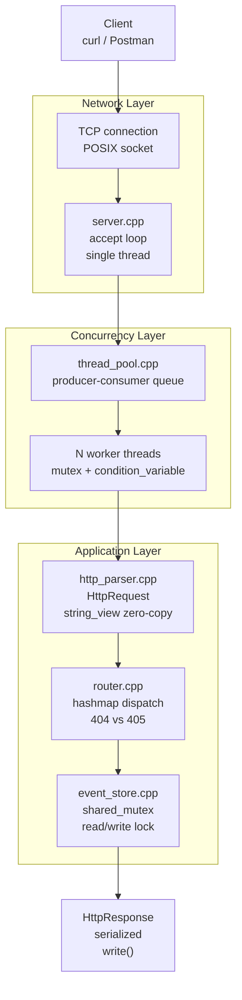

# http-event-server

A minimal HTTP/1.1 server written in C++17 from scratch — no networking frameworks, no external dependencies beyond GoogleTest. Built to demonstrate real understanding of systems programming: POSIX sockets, concurrent request handling via thread pool, manual HTTP parsing, and modular architecture design.

---

## Why this exists

Most backend developers use frameworks that abstract away the network layer entirely. This project deliberately removes those abstractions to expose what actually happens when a client sends an HTTP request: bytes arrive over TCP, get parsed into structured data, get routed to a handler, and a serialized response goes back the same way.

---

## Architecture



Each layer has a single responsibility. No layer knows the internal details of another.

---

## Components

### ThreadPool (`thread_pool.hpp / .cpp`)
Fixed-size pool of worker threads. Implements the producer-consumer pattern: the accept loop enqueues file descriptors, workers dequeue and process them. Uses `std::condition_variable` to avoid busy-waiting and `std::lock_guard` (RAII) to guarantee mutex release on any code path.

Why fixed size and not one-thread-per-connection: each Linux thread consumes ~8MB of stack. 10,000 concurrent connections would require 80GB of memory. A fixed pool bounds memory usage regardless of load.

### HttpParser (`http_parser.hpp / .cpp`)
Parses raw HTTP/1.1 request text into a typed `HttpRequest` struct. Splits on `\r\n\r\n` to separate headers from body, processes the request line with `std::istringstream`, and builds a header map from `key: value` pairs. Returns `false` on malformed input — forces callers to handle the error case explicitly.

### Router (`router.hpp / .cpp`)
Maps `"METHOD /path"` keys to `std::function<HttpResponse(const HttpRequest&)>` handlers. Distinguishes 404 (route not registered) from 405 (route exists but wrong method) — semantically different errors that give clients actionable information.

### EventStore (`event_store.hpp / .cpp`)
Thread-safe in-memory storage using `std::shared_mutex` (C++17). Multiple threads can read simultaneously via `std::shared_lock`. Writes acquire `std::unique_lock` for full exclusion. JSON serialization is manual — no external libraries for two simple structs.

---

## Endpoints

```
POST /events          Register a new event
GET  /events          Return all events
GET  /events/:id      Return a specific event by id
```

### Example

```bash
# Register an event
curl -X POST http://localhost:8080/events \
  -H "Content-Type: application/json" \
  -d '{"type":"login","user":"alejandra"}'

# Response
{"id":1,"status":"created"}

# List all events
curl http://localhost:8080/events

# Response
[{"id":1,"type":"generic","payload":"{\"type\":\"login\",\"user\":\"alejandra\"}","timestamp":"2026-04-23T18:29:10Z"}]

# Get by id
curl http://localhost:8080/events/1
```

---

## Build and run

**Requirements:** GCC 13+, CMake 3.28+, Ninja, Linux (or WSL2 on Windows)

```bash
# Clone
git clone https://github.com/veliz-a/http-event-server.git
cd http-event-server

# Build
cmake -B build -G Ninja
cmake --build build

# Run
./build/http-event-server
# Server listening on port 8080

# Run tests
./build/http-server-tests
```

---

## Performance

Benchmarked with `wrk` on WSL2, Ubuntu 24.04, 4-thread pool.

| Scenario | Threads | Connections | Req/sec | Avg latency |
|----------|---------|-------------|---------|-------------|
| GET high concurrency | 4 | 100 | 62,722 | 15.26ms |
| GET low concurrency | 4 | 10 | 53,567 | 111µs |
| POST low concurrency | 4 | 10 | 50,437 | 233µs |

The GET/POST latency difference (111µs vs 233µs) reflects the cost of `unique_lock` (exclusive write) versus `shared_lock` (concurrent read) — empirical evidence of the readers-writer lock impact.

Note: benchmarks show socket errors in read. Cause: `wrk` reuses TCP connections by default (keep-alive), but this server closes connections after each response. The requests are processed correctly — the error occurs when `wrk` attempts to read on a connection the server already closed. Declared as a known limitation.

WSL2 adds I/O virtualization overhead. Results on bare-metal Linux would be higher.

---

## Design decisions

| Decision | Alternative considered | Reason |
|----------|----------------------|--------|
| Thread pool | One thread per connection | Bounded memory regardless of load |
| Thread pool | epoll + async I/O | epoll is more efficient but unnecessary complexity for this scope |
| POSIX sockets directly | Boost.Asio / libuv | Goal is OS-level understanding, not abstraction usage |
| `std::string_view` in parser | `std::string` | Avoids copies in the hot path (zero-copy parsing) |
| `std::shared_mutex` in store | `std::mutex` | Concurrent reads are safe; only writes need full exclusion |
| Manual JSON serialization | nlohmann/json | External dependency unnecessary for two simple structs |

---

## Known limitations

These are documented intentionally — understanding the boundaries of a system is as important as understanding what it does.

- No HTTP keep-alive: connection closes after each response
- No HTTP/2 support
- No TLS (not suitable for production use)
- Request buffer fixed at 4096 bytes — larger requests are truncated
- In-memory storage: events are lost on restart
- Fixed thread pool size: does not adapt to variable load
- Router uses exact path matching: `/events/1` and `/events/2` require separate route registrations (no dynamic path parameters)
- Parser does not handle chunked transfer encoding

---

## Stack

- C++17
- CMake 3.28+ with Ninja
- POSIX sockets (Linux)
- GoogleTest 1.14.0 (via CMake FetchContent)

---

## References

- Beej's Guide to Network Programming — https://beej.us/guide/bgnet/
- RFC 7230: HTTP/1.1 Message Syntax — https://datatracker.ietf.org/doc/html/rfc7230
- Williams, A. (2019). *C++ Concurrency in Action* (2nd ed.). Manning.
- Ousterhout, J. (2018). *A Philosophy of Software Design*. Yaknyam Press.
- Crafting Interpreters — https://craftinginterpreters.com/

---

*Alejandra Veliz Garcia — github.com/veliz-a*